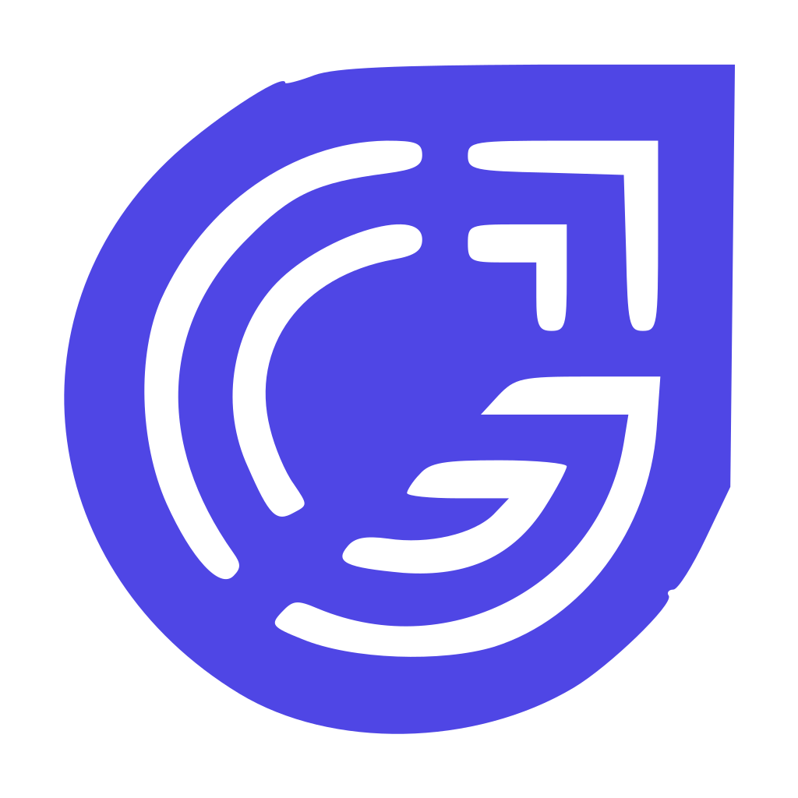

  

  # NeoDesk

  **Escritorio remoto rápido, estable y bajo control propio.**

  Windows · Linux · Conexión directa entre equipos · Cifrado extremo a extremo

---

## Por qué existe

NeoDesk nació de un problema concreto y cotidiano: **el acceso remoto se caía**.

Trabajando a diario entre la oficina y equipos en casa, las herramientas comerciales
fallaban justo cuando hacían falta. Sesiones que se cortaban solas. Reconexiones a
mitad de una tarea. Un rendimiento en Linux notablemente peor que en Windows, con
retrasos entre el clic y la respuesta que rompían el ritmo de trabajo.

Cada corte costaba tiempo: retomar el contexto, volver a abrir lo que estabas
haciendo, explicar al compañero del otro lado que había que empezar de nuevo.

Así que en lugar de seguir peleando con una herramienta que no daba la talla,
decidimos construir la nuestra.

## Qué busca

**Velocidad.** Que la sesión responda al instante. El vídeo viaja **directo entre los
dos equipos**, sin dar rodeos por servidores intermedios cuando la red lo permite.

**Estabilidad en Linux.** Tratado como plataforma de primera, no como añadido.
Captura eficiente, aceleración por hardware y sesiones que aguantan.

**Latencia baja.** Codificación acelerada por GPU cuando está disponible y ajuste
automático de calidad según la red, para que la imagen no se atasque.

**Control propio.** Sin depender de la infraestructura de terceros. Quien quiera
puede alojar su propio servidor de conexión y que el tráfico no salga de su red.

**Sencillez.** Se instala y funciona. El usuario abre la aplicación, ve su ID y su
contraseña, y conecta. Sin configurar nada.

## Cómo funciona

Los dos equipos se conectan **directamente entre sí**. El servidor solo actúa de
punto de encuentro: presenta a las dos máquinas y se aparta. No ve la pantalla,
no ve las contraseñas, no guarda el contenido de la sesión.

Todo el tráfico va **cifrado de extremo a extremo**. Las claves se negocian entre
los equipos, no en el servidor.

Cuando la red impide la conexión directa, el tráfico pasa por un relé que actúa
como simple tubería: tampoco puede descifrar nada.

## Instalación

**Linux** (Debian, Ubuntu, Mint) — descargar el `.deb` y hacer doble clic sobre
él. Se abre el instalador de paquetes del sistema; confirmar y listo.

**Windows** — descargar el `.exe` y hacer doble clic.

En ambos casos la aplicación queda disponible en el menú de aplicaciones. Al
abrirla muestra el ID del equipo y su contraseña de acceso.

## Uso

1. Abrir NeoDesk en el equipo al que quieres conectarte y anotar su **ID**
2. En tu equipo, escribir ese ID y pulsar **Conectar**
3. Introducir la contraseña que muestra el equipo remoto

## Estado

Proyecto de uso interno, en desarrollo activo.

## Créditos y licencia

Distribuido bajo licencia **AGPL-3.0** — ver [LICENCE](LICENCE).

NeoDesk se apoya en el trabajo del proyecto de código abierto
[RustDesk](https://github.com/rustdesk/rustdesk) y de la comunidad de software
libre que lo hace posible. Esta es una versión modificada, adaptada a nuestras
necesidades de marca, despliegue e infraestructura.
